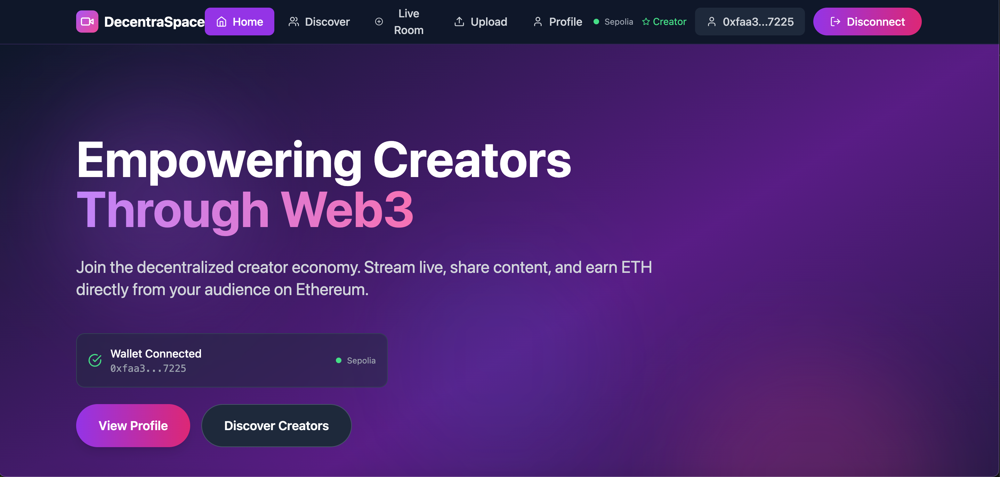
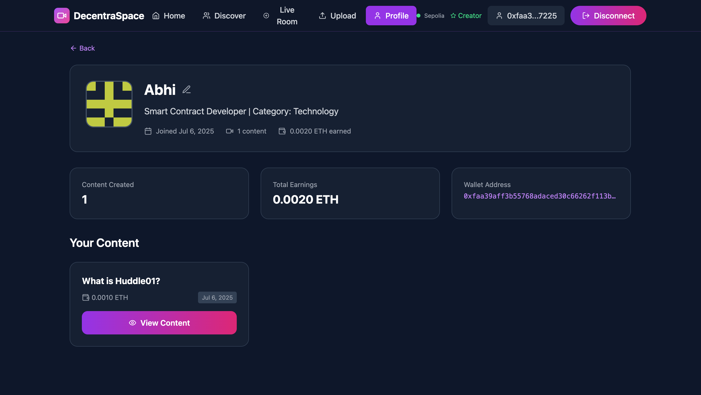
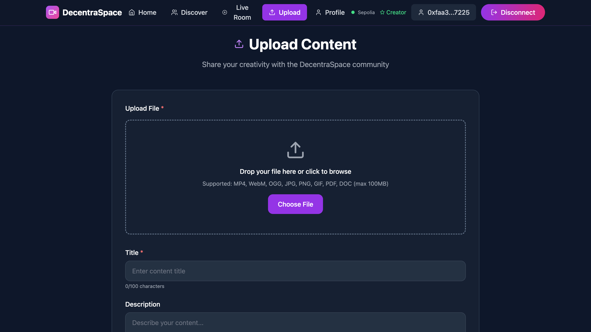
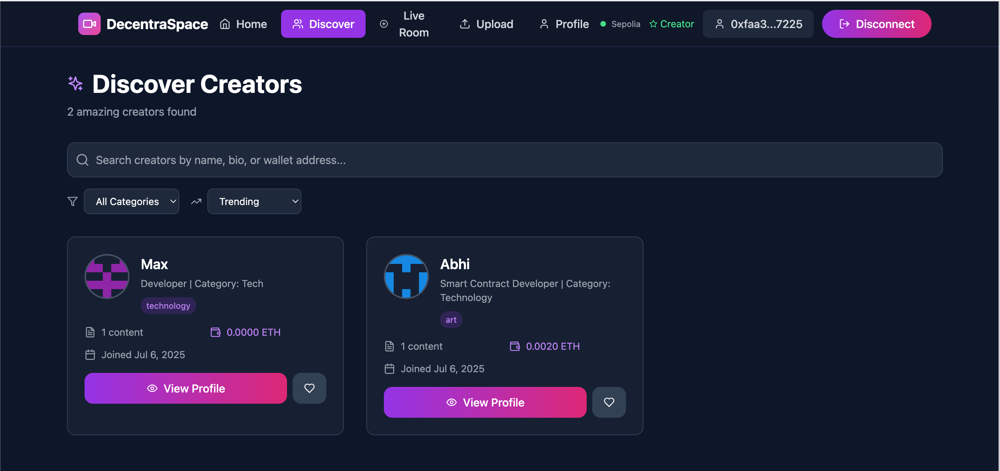
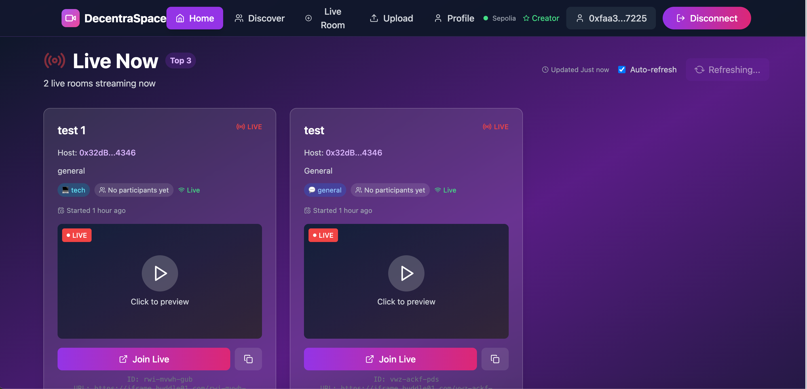

# 🚀 DecentraSpace
*The First Truly Decentralized Live Streaming & Content Platform*

<div align="center">

## 🌟 Overview

DecentraSpace revolutionizes content creation by combining live streaming, content uploads, and creator monetization through blockchain technology. Built on Ethereum with Huddle01's decentralized video infrastructure, it eliminates platform censorship and gives power back to content creators.

### ✨ Key Features

#### **Core Platform Features**
- 🔒 **Web3 Authentication** - Wallet-based identity with MetaMask
- ⛓️ **Blockchain Verified** - All data stored on Ethereum smart contracts
- 🎥 **Decentralized Video** - Powered by Huddle01's peer-to-peer network
- 📊 **Real-time Updates** - Live dashboard with blockchain synchronization

#### **Creator Features**
- 👤 **Creator Profiles** - Customizable profiles with bio, category, and earnings tracking
- 📤 **Content Upload** - Upload videos, images, and documents (MP4, WebM, OGG, JPG, PNG, GIF, PDF)
- 💰 **Tip System** - Direct ETH tips to creators and individual content pieces
- 🎬 **Live Streaming** - Create and host decentralized live rooms
- 📈 **Earnings Dashboard** - Track total earnings and content performance

#### **Discovery Features**
- 🔍 **Discover Creators** - Browse and search creators by name, bio, or wallet address
- 🏷️ **Category Filtering** - Filter by Technology, Art, Gaming, Education, etc.
- 📊 **Trending System** - Discover popular creators and content
- ❤️ **Favorite System** - Save favorite creators for quick access

---

## 📸 Platform Screenshots

### **Home Page**

*Empowering Creators Through Web3 - The main landing page with wallet connection*

### **Creator Profile**

*Detailed creator profile showing content, earnings, and wallet information*

### **Upload Content**

*Simple drag-and-drop interface for uploading various content types*

### **Discover Creators**

*Browse and search through amazing creators with category filters*

### **Create Live Room**

*Easy room creation with title, description, and category selection*

---

## 🛠️ Tech Stack

### **Frontend**
- ⚛️ **React 18** with TypeScript
- 🎨 **Tailwind CSS** for responsive design
- 🔗 **ethers.js** for Web3 integration
- 📱 **Lucide React** for modern icons
- 🚀 **Vite** for fast development
- 📤 **File Upload** support for multiple formats

### **Backend**
- 🟢 **Node.js** with Express
- ☁️ **Vercel Serverless** functions
- 🎯 **Huddle01 SDK** for video infrastructure
- 💾 **IPFS Integration** for decentralized storage
- 🔐 **Environment-based** configuration

### **Blockchain**
- ⛓️ **Ethereum** smart contracts (Solidity)
- 🧪 **Sepolia Testnet** for development
- 🦊 **MetaMask** wallet integration
- 📝 **Hardhat** for contract deployment
- 💎 **ETH Tipping** system on-chain

### **Video & Storage**
- 🎥 **Huddle01** decentralized RTC network
- 📦 **IPFS** for content storage
- 🔒 **End-to-end encryption**
- ⚡ **Real-time streaming** capabilities

---

## 🚀 Quick Start

### **Prerequisites**
- **Node.js** 18+ 
- **MetaMask** browser extension
- **Sepolia ETH** for transactions (get from [faucet](https://sepoliafaucet.com/))

### **1. Clone the Repository**
```bash
git clone https://github.com/AbhiXverse/DecentraSpace.git
cd DecentraSpace
```

### **2. Install Dependencies**
```bash
# Install frontend dependencies
npm install

# Install backend dependencies
cd backend
npm install
cd ..
```


### **3. Start Development Servers**

**Terminal 1 - Backend Server:**
```bash
cd backend
node server.js
```

**Terminal 2 - Frontend Development:**
```bash
npm run dev
```

### **5. Access the Application**
- **Frontend**: http://localhost:5173
- **Backend Health**: http://localhost:3001/api/health

---

## 🎬 Platform Features in Detail

### **1. Web3 Authentication & Profile**
- Connect MetaMask wallet (Sepolia testnet)
- Automatic profile creation with wallet address
- Customize bio, category, and display name
- Track content uploads and total earnings
- View detailed wallet information

### **2. Content Upload System**
- **Supported Formats**: MP4, WebM, OGG, JPG, PNG, GIF, PDF, DOC
- **Max File Size**: 100MB
- **Metadata**: Title, description, category
- **Blockchain Storage**: Content hash stored on-chain
- **IPFS Upload**: Actual files stored on IPFS
- **Instant Publishing**: Content immediately available

### **3. Creator Discovery**
- **Search Options**: 
  - By creator name
  - By bio keywords
  - By wallet address
- **Filters**:
  - Category (Tech, Art, Gaming, Education, etc.)
  - Trending creators
  - Most recent
  - Highest earnings
- **Creator Cards**: Show profile pic, bio, content count, earnings

### **4. Tipping System**
- **Tip Creators**: Send ETH directly to creator wallets
- **Tip Content**: Support specific content pieces
- **On-chain Transactions**: All tips recorded on blockchain
- **Instant Settlement**: Creators receive tips immediately
- **Transparent History**: All transactions viewable on Etherscan

### **5. Live Streaming**
- **Create Rooms**: Set title, description, and category
- **Huddle01 Integration**: Decentralized video infrastructure
- **Real-time Dashboard**: See active streams and participants
- **Join with One Click**: Easy access to live rooms
- **No Central Servers**: Fully peer-to-peer streaming

### **6. Profile Management**
- **Update Profile**: Change bio, category, display name
- **Content Management**: View and manage uploaded content
- **Earnings Tracking**: Monitor tips and total earnings
- **Analytics**: See content performance metrics
- **Export Data**: Download your data anytime

---

## 🌐 Smart Contract Functions

### **Content Management**
```solidity
// Upload content metadata
function uploadContent(string memory contentHash, string memory metadata)

// Get creator's content
function getCreatorContent(address creator) returns (Content[] memory)

// Update content metadata
function updateContent(uint256 contentId, string memory newMetadata)
```

### **Tipping System**
```solidity
// Tip a creator
function tipCreator(address creator) payable

// Tip specific content
function tipContent(uint256 contentId) payable

```

### **Profile Management**
```solidity
// Update creator profile
function updateProfile(string memory bio, string memory category)

// Get creator statistics
function getCreatorStats(address creator) returns (Stats memory)
```

---

## 🧪 Testing the Application

### **Local Testing Checklist**
- [ ] **Wallet Connection**: Connect MetaMask on Sepolia testnet
- [ ] **Profile Creation**: Set up creator profile with bio
- [ ] **Content Upload**: Test uploading different file types
- [ ] **Creator Discovery**: Search and filter creators
- [ ] **Tipping System**: Send test tips to creators/content
- [ ] **Live Streaming**: Create and join live rooms
- [ ] **Profile Updates**: Modify profile information

### **API Testing**
```bash
# Test backend health
curl http://localhost:3001/api/health

# Test room creation
curl -X POST http://localhost:3001/api/huddle/create-room \
  -H "Content-Type: application/json" \
  -d '{"title":"Test Room","hostAddress":"0x...","description":"Test"}'

# Test content upload
curl -X POST http://localhost:3001/api/ipfs/upload \
  -F "file=@test-video.mp4" \
  -F "title=Test Video" \
  -F "description=Testing upload"
```

---

## 🎯 What Makes DecentraSpace Special

### **🔥 Unique Features**
- **Combined Platform**: Live streaming + content uploads + tipping in one place
- **True Ownership**: Creators own their content and audience data
- **No Middlemen**: Direct creator-to-audience relationships
- **Transparent Earnings**: All transactions visible on blockchain
- **Censorship Resistant**: No central authority can remove content

### **🌟 Problems Solved**
- **Content Censorship**: Decentralized storage prevents takedowns
- **Payment Delays**: Instant ETH settlements
- **Data Ownership**: Creators control their audience data
- **Algorithm Bias**: Transparent discovery system

### **🚀 Future Roadmap**
- **NFT Integration**: Mint content as NFTs
- **Subscription Tiers**: Monthly creator subscriptions
- **DAO Governance**: Community-driven platform decisions
- **Multi-chain Support**: Expand to Polygon, Arbitrum
- **Mobile Apps**: iOS and Android applications
- **Advanced Analytics**: Detailed creator dashboards
- **Collaboration Tools**: Multi-creator streams

---

## 📈 Usage Examples

### **For Creators**
1. **Connect Wallet**: Use MetaMask to sign in
2. **Set Up Profile**: Add bio, select category
3. **Upload Content**: Share videos, images, documents
4. **Go Live**: Start streaming to your audience
5. **Earn Tips**: Receive ETH directly from supporters

### **For Viewers**
1. **Discover Creators**: Browse by category or search
2. **Watch Content**: Access uploaded videos and documents
3. **Join Live Streams**: Participate in real-time
4. **Support Creators**: Send tips to favorites
5. **Save Favorites**: Build your creator list

---

## 👨‍💻 Created By

**Abhishek Soni**
- **GitHub**: [@AbhiXverse](https://github.com/AbhiXverse)
- **Email**: abhishek2404soni@gmail.com
- **Project**: DecentraSpace - Decentralized Content & Streaming Platform

---

## 🙏 Acknowledgments

- **Huddle01** - For providing decentralized video infrastructure
- **Ethereum** - For blockchain foundation and smart contracts
- **IPFS** - For decentralized content storage
- **Vercel** - For seamless deployment and hosting
- **MetaMask** - For Web3 wallet integration
- **Open Source Community** - For amazing tools and libraries

---

<div align="center">

**Built with ❤️ for the decentralized future of content creation**

</div>
